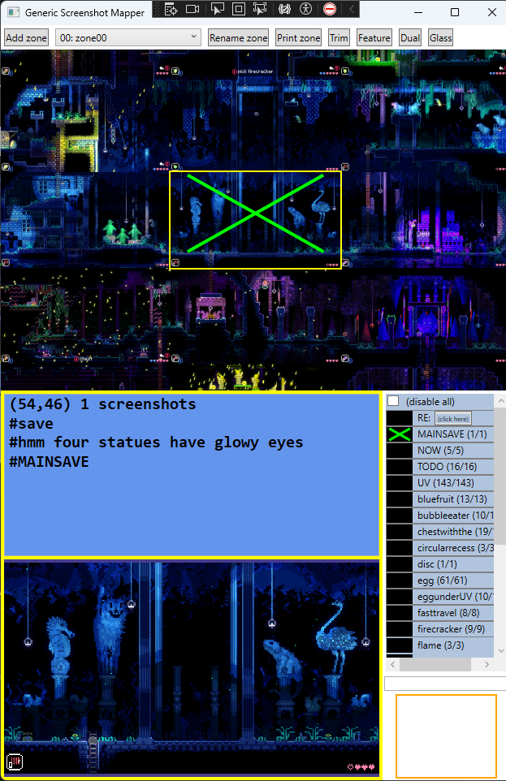
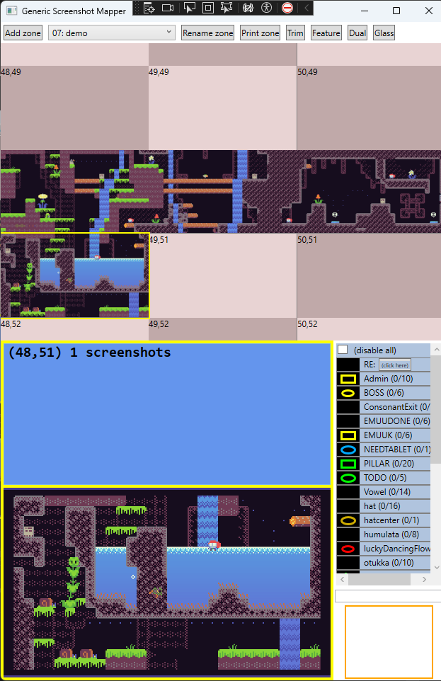
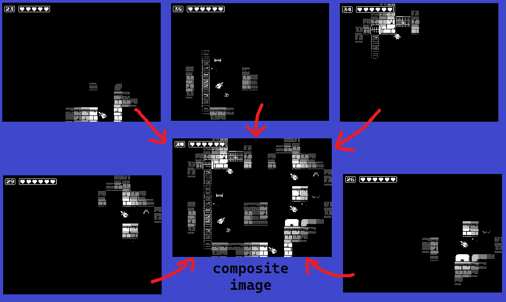

# Screenshot Map Tool

A tool for making screenshot maps of 2-D screen-at-a-time games, and for taking notes
associated with locations of the map.

This document is a work in progress (as is the tool).

### Pre-requisites

To use the tool, you currently will need

* To be running Win10 or Win11

* To play the targetted game in a window of a constant fixed size of your choosing

* A keyboard with a num-pad

### Basic Controls - Screenshots on a grid

The tool is designed to visible to player (off to the side, or on a separate monitor)
while they are playing the game (via keyboard or controller).  The basic controls of
the tool run via num-pad hotkeys that allow you to move the cursor around the map grid 
and take screenshots without ever needing have the game lose focus.

The top area of the tool window displays a grid for screenshots.  A yellow box around
one cell of the grid is the current location cursor.  The most essential controls:

* `(Numpad) 8 2 4 6`: move the cursor Up Down Left Right on the grid

* `(Numpad) 0`: takes a screenshot of the game window, and drops it into the current grid cell

* `(Numpad) 7` and `9`: zoom In and Out on the map grid, to get a more focused, or wider, view

The tool supports a grid of 100x100 cells, and starts you by default at coordinate (50,50).
So when you start the game, you can put the first screenshot at (50,50) and then just start 
building your map from there and have plenty of room to build in all 4 directions.  

For an example, here's how you'd use the tool at the very beginning of playing EMUUROM.
When you spawn into the world, press `Numpad 0` to take a screenshot of the first screen.
The only exit is to the left, so after the screen transition in game, press `Numpad 4` to
move the tool's cursor to the left, and then press `Numpad 0` again to take a screenshot
of the second screen and place it left of the first one on the grid.  Repeat the same 
process for the third screen.  Then the only exit from the room is to fall down, so after
that screen transition, press `Numpad 2` to move the cursor down before `Numpad 0` to 
screenshot the 4th room.  The map would now look like this:

Each 100x100 grid is called a 'zone', and you can make multiple zones for games with 
multiple maps (e.g. Zelda1 has overworld ,ap and 9 dungeon maps).  
TODO link to more info on zones

### Multiple screenshots per grid cell

You can put multiple screenshots in a single cell of the map grid.  By default this will 
just 'blend' the screenshots into a composite image, which is useful for many games where
the player gives off a 'light halo' and can only clearly see the portion of the screen they 
are currently in.

Here's an example from the game Minit, where 5 different screenshots taken in the same dark
room can be dropped into the same grid cell to generate a composite image for the map which
illuminates the whole room:

### Cut and paste

You will inevitably make a mistake and put a screenshot in the wrong grid cell.  The tool
has basic cut-and-paste functionality to patch up mistaken screenshots.

Controls:

* `(Numpad) -`: the minus key cuts the most recent screenshot out of the current cell

* `(Numpad) +`: the plus key pastes the most recently cut screenshot to the current cell

The most-recently-cut screenshot appears in a little preview pane in the bottom right corner
of the tool.

### Text notes and #hashtag labels

You can make text notes for each cell on the grid.  

* `(Numpad) /`: pressing slash gives the tool focus and opens a textbox dialog to edit the text
		in the current cell.  

Type with the keyboard.  Press Ctrl-Enter to add a newline in the text box; press Enter when 
done.  

Your text can contain #hashtags, alphanumeric labels prefixed by an #octothorpe, which 
enable some more advanced features of tool, like displaying all the #save checkpoint 
locations you have found and marked up, as an example. 
TODO link a separate page about #hashtags

You can also create clickable hyperlinks to jump to other cells by typing e.g. coordinates 
in formats like "(45,55)" or "(zone02,51,52)" which can be useful for marking up fast
travel systems in a game, or doors that lead to different dungeon maps, or whatnot.

When the cursor is on a cell with notes, the bottom left pane of the tool shows a larger
screenshot of that cell, along with your text notes	for that call.

### Glass

The 'glass' button in the upper right launches a separate app window which allow you to put 
a "pane of transparent glass you can draw on" over any window (such as the game).  You can 
use it for basic temporary 'drawing' tasks to display an idea to livestream viewers, for example.

TODO document it

### Other features

TODO eventually document other features

