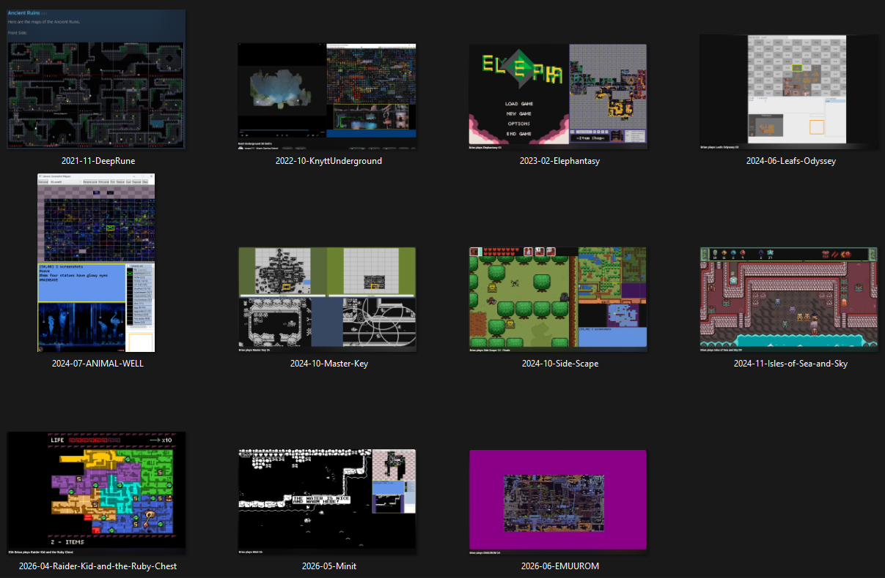

# Screenshot Map Tool

A tool for making screenshot maps of 2-D screen-at-a-time games, and for taking notes
associated with locations of the map.


The tool is a work in progress, but nearing initial release.  [Read documentation here.](doc/main.md)

# Motivation

There's a lot of games where it would be nice to make your own screenshot map.  But the mechanics of actually doing it are a bit of a chore.

I've watched lots of twitch streamers assemble maps by taking screenshots (with various tools like Steam, PrntScrn, Windows Snipping Tool),
saving those screenshots (possibly after spending time trimming or resizing them), and importing those screenshots into some tool for making 
a grid (like Obsidian or GIMP).  Even the more efficient workflows I've witnessed still involve a lot of fiddling about and alt-tabbing between
multiple applications and the game itself.

So I made a tool that makes it simple.  The tool just runs in the background, and at any time you can press `NumPad0` to take a new screenshot
of the game and drop it into the grid, or use `NumPad2468` to move the cursor around the grid, all while the game stays running with focus.

There's lots more features, for notetaking, custom visualizations, and OBS capture.

Check out the [full documentation here](doc/main.md).

# History

At the time I wrote this text section (Oct 2026), I've been working on this app on and off for about five years now.  I'd used some variation of the tool 
for myself on about a dozen games I played on [YouTube](https://www.youtube.com/@lorgon111/playlists) over that time; here's a smattering of suggestive screenshots:



I went back through the repository changelog to get a sense of the major feature work timeline:

```
basic screenshots post-hoc (from videos)
 - Deep Rune                        Nov 2021
 - Knytt Underground                Aug 2022
multiple screenshots and fixed markup
 - Elephantasy                      Feb 2023
cut and paste; notes and hashtags
 - Leaf's Odyssey                   Jun 2024
performance work 
 - ANIMAL WELL                      Jun 2024
clickable hyperlinks 
 - Master Key                       Aug 2024
minimap
 - Side Scape                       Sep 2024
 - Isles of Sea and Sky             Oct 2024
first 'glass' prototype
finally started factoring out a zillion per-game hardcoded 
        constants into json data, made a new-game workflow 
 - Raider Kid and the Ruby Chest    Apr 2026
experiment with auto-tracking 
 - Minit                            May 2026
improved map marker colors and shapes
 - EMUUROM                          Jun 2026
starting Jul 2026, serious work: 
    performance, usability, features, testers, documentation
```

It's been a ton of effort, but a very fun hobby project for me, as I love making maps and organizing notes
(which is probably why my favorite game genres feature exploration and puzzles-requiring-notetaking).

Check out the [full documentation here](doc/main.md).
