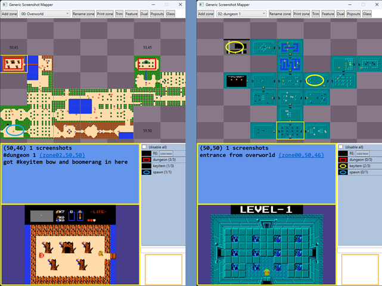

# Screenshot Map Tool

A tool for making screenshot maps of 2-D screen-at-a-time games, and for taking notes
associated with locations of the map.

The tool is a work in progress, but nearing initial release.  [Read documentation here.](doc/main.md)

# Motivation

There's a lot of games where it would be nice to make your own screenshot map.  But the mechanics of actually doing it are a bit of a chore.

I've watched lots of twitch streamers assemble maps by taking screenshots (with various tools like Steam, PrntScrn, Windows Snipping Tool),
saving those screenshots (possibly after spending time trimming or resizing them), and importing those screenshots into some tool for making 
a grid (like Obsidian or GIMP).  Even the more efficient workflows I've witnessed still involve a lot of fiddling about and alt-tabbing between
multiple applications and the game itself.

So I made a tool that makes it simple.  The tool just runs in the background, and at any time you can press `Numpad0` to take a new screenshot
of the game and drop it into the grid, or use `Numpad2468` to move the cursor around the grid, all while the game stays running with focus.

There's lots more features, for notetaking, custom visualizations, and OBS capture.

Check out the [full documentation here](doc/main.md).