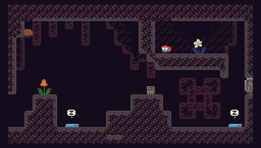
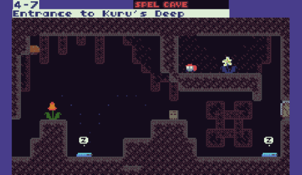
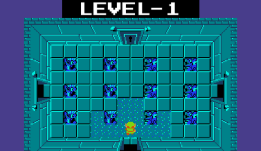
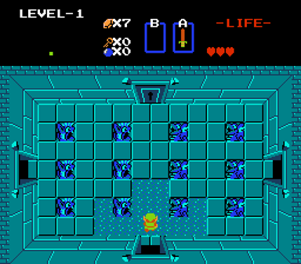
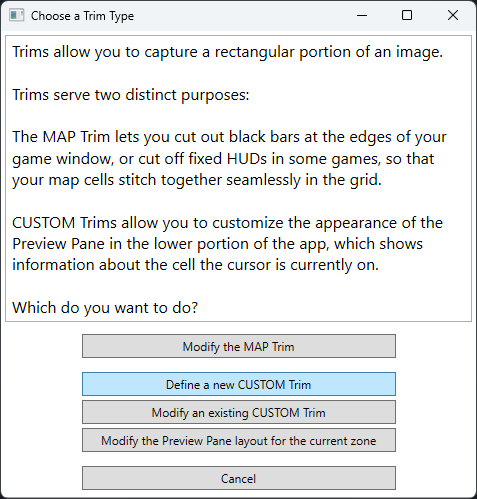
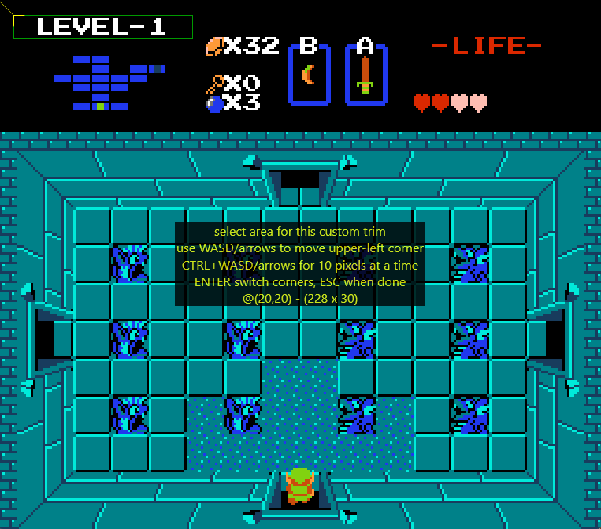
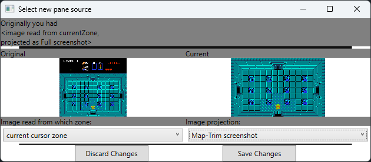
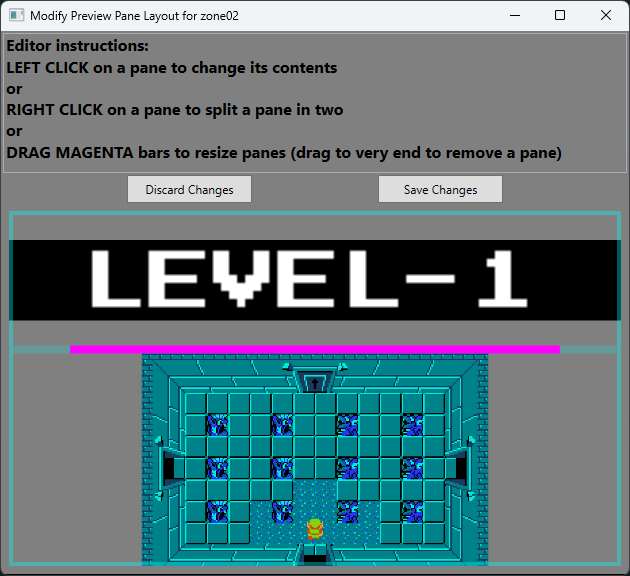

## Customizing the Preview Pane with CUSTOM Trim

By default, the Preview Pane just displays the full screenshot of the cell the cursor is on in the map grid, e.g.

However, you can customize the preview pane to display a composite layout of images trimmed from from multiple
zones, enabling displays such as this:

Let's walk through a simpler example of customizing the Preview Pane using a CUSTOM Trim.  Consider Zelda:

Note that on the left, in the Overworld (zone00), the preview pane had its default behavior of showing the 
full screenshot.  Whereas on the right, dungeon 1 (zone02) was customized to show just the MAP Trim area
of the screen, with the dungeon label (a CUSTOM Trim) above it:

To accomplish this, consider the full screenshot from that screen:

Making the customized Preview Pane display involved two steps:

* Defining a CUSTOM Trim that trims out the rectangular sections of the full screenshot around "LEVEL-1"
* Customizing the Preview Pane layout for this zone, to display the MAP Trim in the lower portion of the pane,
and the CUSTOM Trim above that

Let's walk through those steps.

### Defining a CUSTOM Trim

To define a CUSTOM Trim, click the 'Trim' button at the top of the app and then click on the appropriate
button in the ensuing menu:

You'll be asked to provide a name for this trim, so that we can refer to it later.  Something like 'dungeon name' is fine.

Then select the screen area we want to trim (this UI works just like the [MAP Trim you may have set up when setting up
the game](setup.md):

Now that we've defined a CUSTOM Trim, we can customize the Preview Pane display for this zone to use it.

### Modifying the Preview Pane layout

Once again, click the 'Trim' button at the top of the app, but this time click the option to modify the Preview Pane
layout.  A new 'Modify Preview Pane Layout' dialog box shows the preview pane along with instructions for modifying it.

The first step is to change the source of the existing image from 'Full Screenshot' to 'Map-Trim screenshot'.
Left-click the image in the pane to bring up this dialog and select the Map-Trim from the dropdown in the lower right:

Click 'Save changes'.

Next we want to split the pane in two, which we do by right-clicking the image in the 'Modify Preview Pane Layout' 
dialog and choosing 'split with empty pane above' from the ensuing context menu.

Next, left-click on the empty pane, and in the dialog, in the lower left change the dropdown from 'this pane should 
just always be empty' to 'current cursor zone', and in the lower right change the dropdown to 'Trim:custom00:dungeon name',
the CUSTOM Trim that we defined in the prior step.  Click 'Save changes'.

Finally, drag the magenta bar between the two panes to change the relative size proportions of the two panes:

until it matches the desired layout.  Click 'Save changes'.

### Summary 

The UI for customizing the Preview Pane is a little clunky, but hopefully this walkthrough example shows you the gist.
The end result can create powerful visualizations that utilize screenshots from multiple zones, e.g. the EMUUROM
example where I had taken screenshots of each screen of the world in one zone, and screenshots of the in-game map 
for each of those screens in another zone, and then combined the two into this collage, which acts almost like a 
heads-up display summarizing information about the current screen, in a way that the game itself does not provide:

