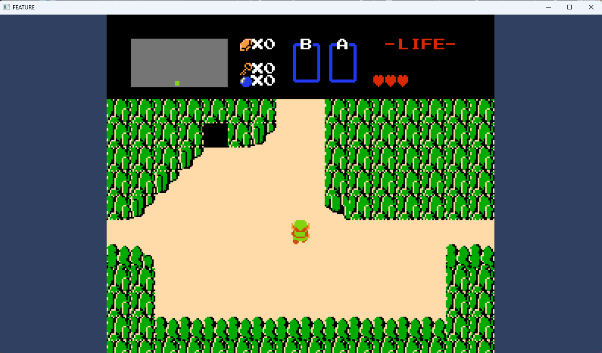
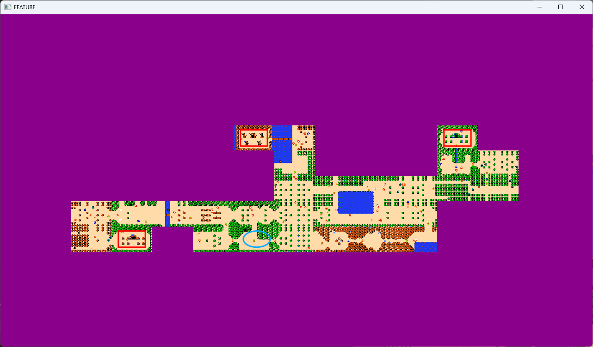
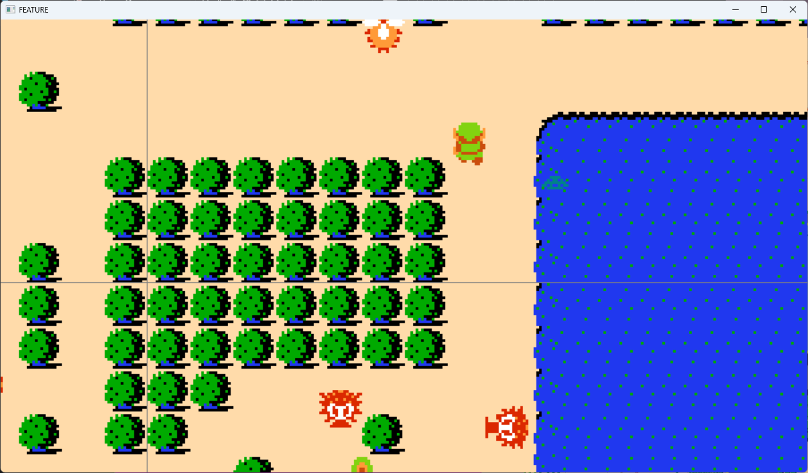
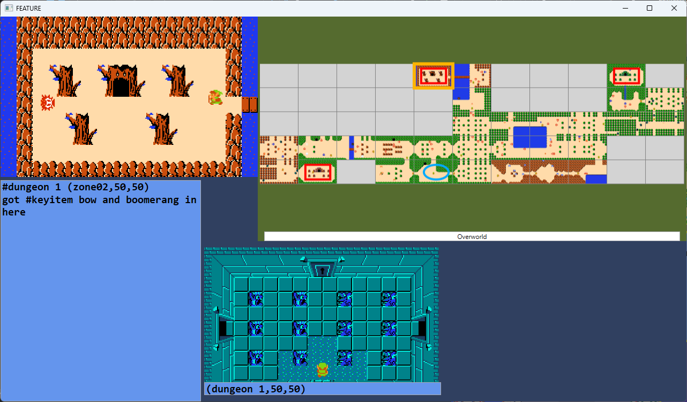

## Feature Window

Most of the tool is designed around keeping the game itself in focus - the tool is designed to run as a background app, and popout windows 
are designed to take up very little screen real estate, all so that the game you're playing remains the focus.

But there are times when you want to focus on the tool.  You might want to scrutinize a high resolution screenshot, you might want to review
your map and notes, or you might be broadcasting to the audience and want your map & notes, rather than the game, to take center stage in your 
OBS layout for a bit.

The Feature Window is designed for those scenarios, and it can be invoked in a few different ways to project different data/visualizations.

### Look at one (untrimmed) screenshot

If you right-click on a cell in the grid of the main app window, you can 'Feature' just the content of that cell.

Note that if multiple screenshots are in that cell, and you want a specific one, you can select that cell and right click
the preview pane (bottom) in the main app window to bring up a dialog window which shows all the screenshots
in that cell.  Right click an individual screenshot from that dialog to 'Feature' it.

(When featuring a single screenshot, right clicking the picture in the Feature window itself will populate the clipboard with the filename
on disk where that particular screenshot lives.)

### Pan and Zoom the whole zone Map

Pressing `Numpad 1` will 'Feature' the entire map grid where you can 'pan' the map by (left-click) dragging, and zoom in and out using 
the mouse scroll-wheel.  This can be useful to show the 'big picture' of an area or to get a close look at the boundary between two screens,
for example.  A couple of example screenshots are suggestive:

TODO discuss ctrl-1

### Full zone with notes and links

The 'Feature' button at the top of the app will 'Feature' a window showing the full map of the zone, where hovering each individual cell
shows its notes on the left, and any hyperlinked cells on the bottom.  

### Comparing two zone side by side

The 'Dual' button at the top of the app will ask you for two zones, and a range of cells, and show both zones' overview map. Mouse hovering 
any cell will show a larger preview of the corresponding cell in both zones.

In the picture above, I was screenshotting caves in the zone01 layer, and the overworld was in zone00 layer, and I asked 'Dual' to
show me zone00 on the left and zone01 on the right.

### Targeting the Feature Window for OBS capture

The Feature Window always has the title 'FEATURE', making it easy to target with OBS.  

You might, for instance, capture the Feature Window in the layer just above the game window, with the same size as the game, in your OBS 
layout, so that the Feature Window takes precedence.  Then any time you use the Feature Window, your audience will see what you are doing, 
and whenever you are done you can close the Feature Window and go back to the game.

