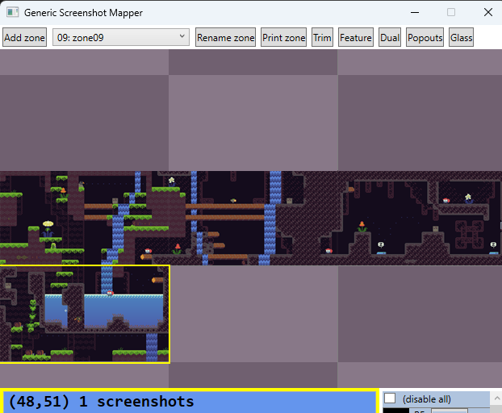
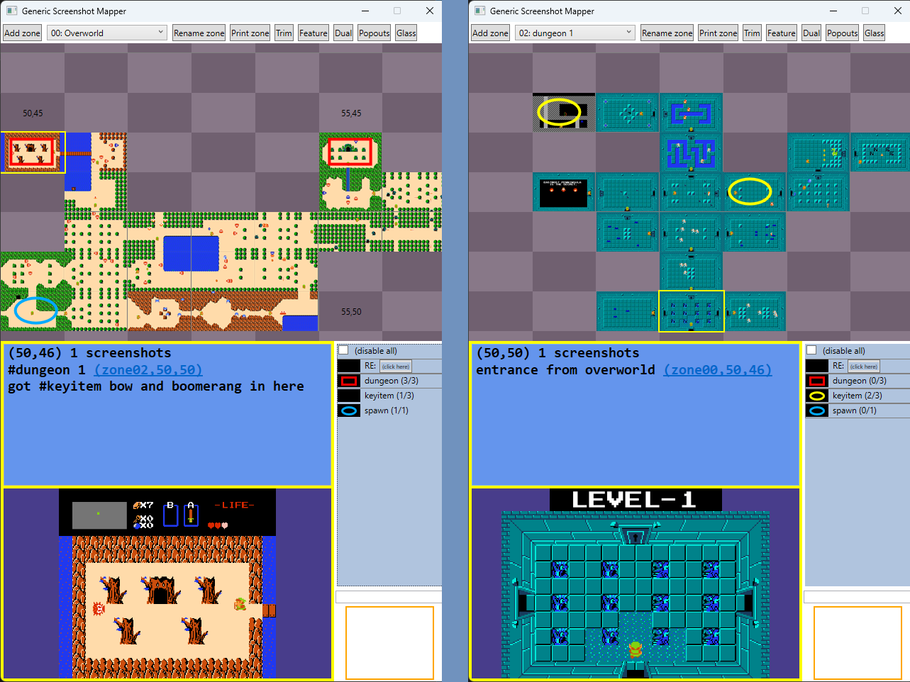
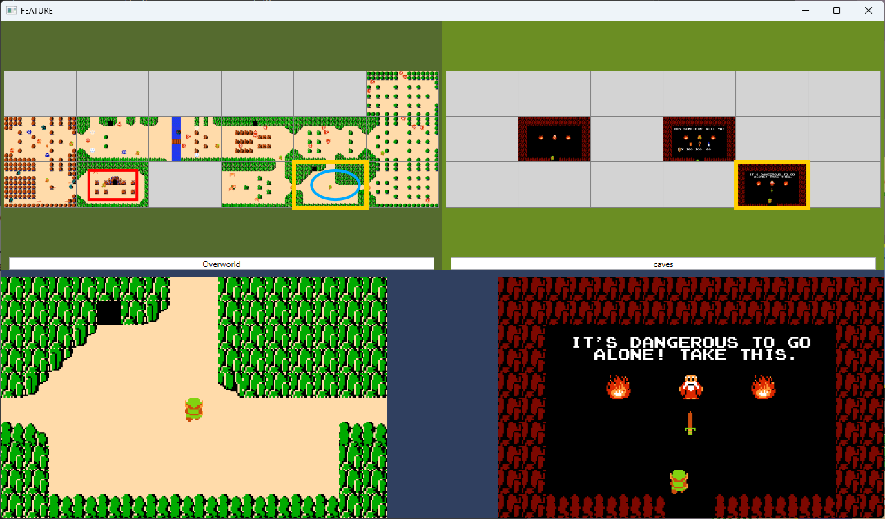
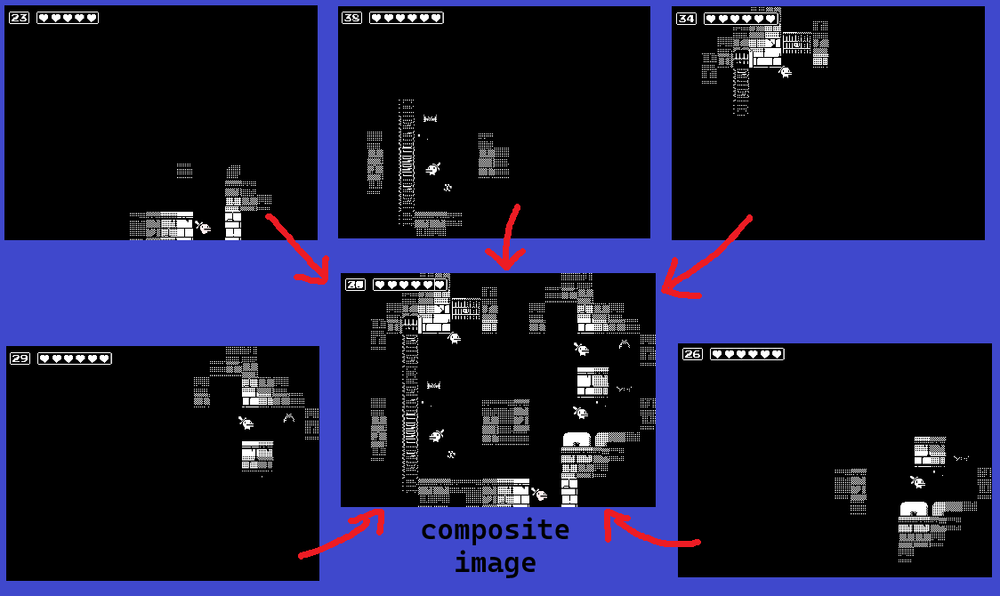
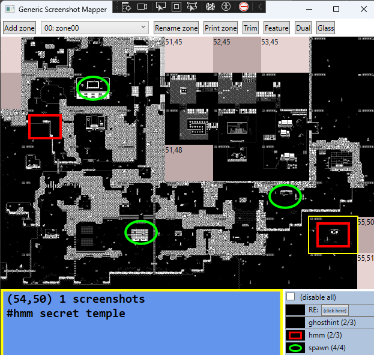
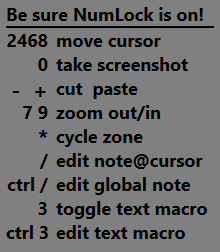
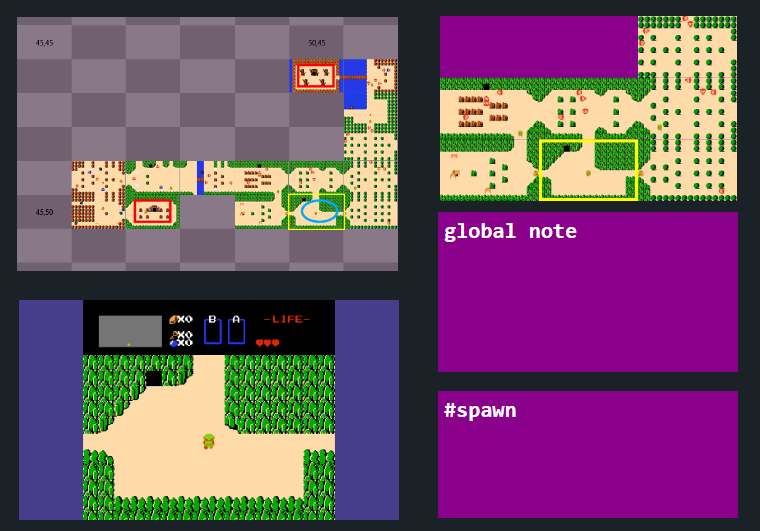
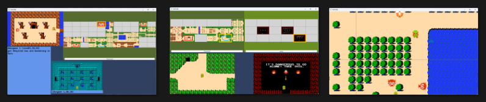
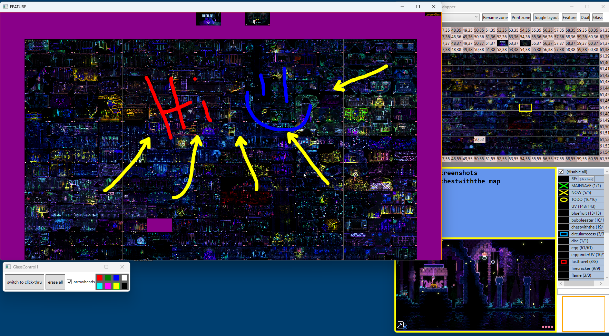

# ScreenshotMapTools full documentation

## On this page

SETUP
* [Downloading and running the tool](#downloading)
* [Setting up a new game for the tool](#newgamesetup)

TAKING SCREENSHOTS AND NOTES
* [Basic Controls - Screenshots on a grid](#basiccontrols)
* [Multiple screenshots per grid cell](#multiplescreenshots)
* [Cut and paste](#cutandpaste)
* [Text notes and #hashtag labels](#textnotes)

FEATURES FOR USER-PRODUCTIVITY AND OBS-BROADCASTING
* [Popout windows](#popouts)
* [Exporting maps](#export)
* [The 'Feature' window](#feature)
* [Advanced Navigation](#navigation)
* [Glass tool for scribbling](#glass)

Jump to any of the linked topics above, or scroll down to read them one-by-one.

## Downloading and running the tool

See the [download page](download.md) for information.

## Setting up a new game for the tool

See the [setup page](setup.md) for instructions setting up a new game.

## Basic Controls - Screenshots on a grid

The tool is designed to visible to player (off to the side, or on a separate monitor)
while they are playing the game (via keyboard or controller).  The basic controls of
the tool run via num-pad hotkeys that allow you to move the cursor around the map grid 
and take screenshots without ever needing to alt-tab or have the game lose focus.

The top area of the tool window displays a grid for screenshots.  A yellow box around
one cell of the grid is the current location cursor.  The most essential controls:

* `(Numpad) 8 2 4 6`: move the cursor Up Down Left Right on the grid

* `(Numpad) 0`: takes a screenshot of the game window, and drops it into the current grid cell

* `(Numpad) 7` and `9`: zoom In/Out on the map grid, to get a more focused/wider view

The tool supports a grid of 100x100 cells, and starts you by default at coordinate (50,50).
So when you start the game, you can put the first screenshot at (50,50) and then just start 
building your map from there and have plenty of room to build in all 4 directions.  

For an example, here's how you'd use the tool at the very beginning of playing EMUUROM.
When you spawn into the world, press `Numpad 0` to take a screenshot of the first screen.
The only exit is to the left, so after the screen transition in game, press `Numpad 4` to
move the tool's cursor to the left, and then press `Numpad 0` again to take a screenshot
of the second screen and place it left of the first one on the grid.  Repeat the same 
process for the third screen.  Then the only exit from the room is to fall down, so after
that screen transition, press `Numpad 2` to move the cursor down before `Numpad 0` to 
screenshot the 4th room.  The map would now look like this:

Each 100x100 grid is called a 'zone', and you can make multiple zones for games with 
multiple maps.  For example, in The Legend of Zelda, there is an overworld map and 9
dungeon maps, so it makes sense to put each map in its own zone.  You can add a new zone
or rename the current zone using the buttons at the top of the app window, and the dropdown
between those buttons can be used to select which zone to view.  In the example below,
I renamed zone00 'Overworld', added and renamed two more zones (zone01 'caves' not shown;
zone02 'dungeon 1' shown on the right):

Sometimes it makes sense to specially align the coordinates of screenshots in two zones.
Each time there was a cave at coordinate (zone00,x,y) on the Overworld, I took an interior
screenshot of the cave at (zone01,x,y).  This helps enable some other useful features of
the tool, such as a 'Dual' Feature Window, shown below (and described more [here](feature.md#dual)).

## Multiple screenshots per grid cell

You can put multiple screenshots in a single cell of the map grid.  By default this will 
just 'blend' the screenshots into a composite image, which is useful for many games where
the player gives off a 'light halo' and can only clearly see the portion of the screen they 
are currently in.

Here's an example from the game Minit, where 5 different screenshots taken in the same dark
room can be dropped into the same grid cell to generate a composite image for the map which
illuminates the whole room:

## Cut and paste

You will inevitably make a mistake and put a screenshot in the wrong grid cell.  The tool
has basic cut-and-paste functionality to patch up mistaken screenshots.

Controls:

* `(Numpad) -`: the minus key cuts the most recent screenshot out of the current cell

* `(Numpad) +`: the plus key pastes the most recently cut screenshot to the current cell

The most-recently-cut screenshot appears in a little preview pane in the bottom right corner
of the tool.

## Text notes and #hashtag labels

You can make text notes for each cell on the grid.  

* `(Numpad) /`: pressing slash gives the tool focus and opens a textbox dialog to edit the text
		in the current cell.  

Type with the keyboard.  Press Ctrl-Enter to add a newline in the text box; press Enter when 
you are all done.

When the cursor is on a cell with notes, the bottom left pane of the tool shows a larger
screenshot of that cell, along with your text notes	for that call.

Your text can contain **#hashtags**, alphanumeric labels prefixed by an #octothorpe, which 
enable some more advanced features of tool, like, for example, displaying all the #save checkpoint 
locations you have found and marked up, or all the #shop or #dungeon locations you find, or 
whatever is suitable to the game you are playing. 

Here's an example from Minit where I marked up the different places the player could #spawn, as 
well as left myself some #hmm notes on places I wanted to return to investigate further.  
Left-clicking a #hashtag in the tool's bottom-right-pane list will highlight the #hashtag's 
locations on the map, and right-clicking lets you change the color and shape of the highlight markings.

You can also create clickable **hyperlinks** to jump to other cells by typing e.g. coordinates 
in formats like "(45,55)" or "(zone02,51,52)" which can be useful for marking up fast
travel systems in a game, or doors that lead to different dungeon maps, or whatnot.

There is also a 'global note', that is, a note which is not associated with any particular
map cell.  You can edit the global note with

* `(Numpad) Ctrl-/`: pressing ctrl-slash gives the tool focus and opens a textbox dialog to edit the text
		of the global note.  It also creates the global note [popout window](#popouts) if that popout
		was not already active.

The global note is displayed in a popout window, which you can move or resize to keep it visible anywhere 
on your desktop, if desired; see [popouts](#popouts) for more info.

## Popout windows

Popouts are little chrome-less windows that display useful projections of information in the app.  One example
popout that new users are likely to want is the 'Controls Cheatsheet' which summarizes the NumPad keyboard
controls of the app:

All popouts have the same mouse controls for interacting:

* `Left-click-and-drag` within the window: Move a popout window around on your desktop
* `Right click`: Close this popout window
* `Left-click-and-drag` the window edge/corner: Resize the popout window (if applicable)
* `Scroll-wheel`: change the zoom level of the popout (if applicable)

You can manage popouts with the "Popouts" button at the top of the main app.  Here's what various popouts look like:

See the [popouts page](popouts.md) for more information about each popout.

## Exporting maps

After you have made a big screenshot map, you might want to export it as a giant image.  This is what the
'Print Zone' button at the top of the app is for.  It will export a PNG file that encompasses the rectangular 
region containing all the screenshots in the current zone.  It saves it to a file in the app directory called
`printed_map.png`; cells without any screenshots are left transparent.  After clicking the 'Print Zone' button,
the app also opens the install folder, making it easy to find the PNG file it just wrote.

The 'Print Zone' button actually writes two files.  The second is `printed_map_2x2.png`, and is just the same
image repeated four times in a 2x2 grid.  This can be useful for games where the game map is topologically a torus
with wraparound, and the left edge is adjacent to the right edge, or the top edge is adjacent to the bottom edge.
The 2x2 version lets you inspect those edges side-by-side within a single image file.  Note that the main app 
hotkeys `Numpad1` and `Ctrl+Numpad1` are the moral equivalent of printed_map and printed_map_2x2, but rather than
saving them to disk, it displays them in the Feature Window, described next.

(There is currently no mechanism for exporting notes or #hashtag markup.)

## The 'Feature' window

See the [feature page](feature.md) for more information about the Feature Window, which provides a number of large-window visualizations
for when you want to focus on the tool, rather than the game.

## Advanced Navigation

**`Ctrl+direction` movement**: \
Whereas `Numpad 2468` move the cursor highlight from cell to cell in the map grid, holding Ctrl moves the viewport
rather than the cursor.  That is, `Ctrl+Numpad 6` will leave the cursor on the same cell of the map, but move all 
of the cells in the grid one space to the left.

While you typically use the Numpad to move the cursor in the main app window, you can also use the mouse.

**"Mouse Preview"**: \
Mouse hovering a cell will temporarily change the cell highlight that that cell, which enables you to 
quickly glance through the notes/previews of many cells, just by passing the mouse over them.

**"Hard-selection"**: \
Left-clicking on a cell will hard-select that cell, as though you used the Numpad keyboard controls to move the cursor there.  
If the mouse cursor leaves the map grid area without clicking on any cell, the most recently hard-selected cell
(that is, keyboard-selected or clicked-on cell) will regain the highlight.

**Mouse Warping**: \
If the mouse cursor is somewhere inside the map grid, pressing `Numpad 5` will warp the mouse cursor to the most recently
hard-selected cell.  If the most-recently hard-selected cell is the one with the current cell highlight (either because
the mouse cursor is outside the grid, or because the mouse is hovering the hard-selected cell), then pressing `Numpad 5`
will "center" the map, moving the cursor to the middle of the screenshots and framing the viewport so that the cursor is
in the center of it.  So a single `Numpad 5` typically serves to sync up the hard-selected cell with the mouse, and a 
second `Numpad 5` centers the map.  As a consequence of this somewhat peculiar keybinding, you can quickly take a step back 
from zoomed within a large map with e.g. `Numpad 999955` which will zoom out the map 4 levels and then center the map in
the viewport.

(Most readers will want to skip this paragraph; it is mostly written to remind the tool developer the very good reason for
the current state of affairs with mouse-warping shenanigans.) The basic movement keys, `Numpad 2468` also warp the mouse to 
match the cursor highlight, but only if the mouse is over the app.  If the mouse is elsewhere (such as over the game window), 
the app will not warp the mouse cursor.  In other words, the app window won't "steal" the mouse from other windows, but when 
the mouse is over the app, then the app usually tries to keep the mouse cursor and the currently hard-selected cell in-sync.  
The motivation for all this is to reduce errors while preserving the aforementioned "Mouse Preview" feature.  A scenario
explains: Suppose the current hard-selected cell is 50,50, which also has the mouse hovering over it.  Now imagine if moving 
the cursor right with `Numpad 6` _did not_ also warp the mouse.  The cell 51,50 would be hard-selected by the keyboard, but 
the mouse would still be hovering 50,50, and thus 50,50 still has "mouse preview", and thus a subsequent `Numpad 0` would 
dump a new screenshot into 50,50, despite the fact that the user just keyboarded over to 50,51, defying expectations. All this is
complicated to explain, but feels so natural as to go typically unnoticed while using the app.  The mouse-warping has a 
secondary benefit, in that the app always warps the mouse into the center of the current cell.  This makes another type of 
error far less likely, namely the error where you reach your hand from your game controller over to the Numpad to press 
`Numpad 0` to take a screenshot, but in the act, you bump the mouse a tiny bit.  When the mouse starts in the center of a cell, 
tiny movements are less likely to accidentally cause the mouse to wander to a new cell and cause your screenshot to get misplaced.

Editing actions (e.g. `Numpad /0.+-`) target the currently highlighted cell.  As a result, you can use "Mouse Preview" to 
quickly target a cell that's not near the cursor; rather than press e.g. `Numpad 8888/` to edit the Note in the cell four 
cells above the current cell, you could also just push the mouse up to the cell whose Note you want to edit and then press 
`Numpad /`.  Editing actions hard-select the cell being edited, so if afterwards you move the mouse outside the app, the 
cell highlight will remain on the cell that was just edited.

## Glass tool for scribbling

See the [glass page](glass.md) for more information on the glass tool, which lets you draw on any window.

## Other features

TODO eventually document other features (custom trim, preview pane, ...)

