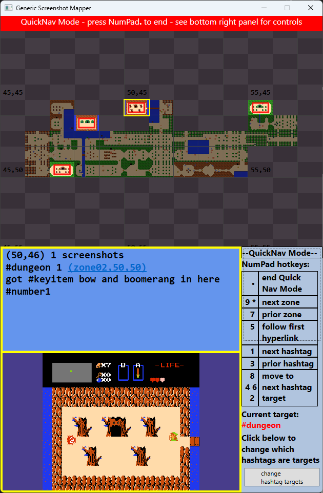

## Advanced Navigation

**`Ctrl+direction` movement**: \
Whereas `NumPad 2468` move the cursor highlight from cell to cell in the map grid, holding `Ctrl` moves the viewport
rather than the cursor.  That is, `Ctrl+NumPad 6` will leave the cursor on the same cell of the map, but move all 
of the cells in the grid one space to the left.

While you typically use the NumPad to move the cursor in the main app window, you can also use the mouse.

**"Mouse Preview"**: \
Mouse hovering a cell will temporarily change the cell highlight that that cell, which enables you to 
quickly glance through the notes/previews of many cells, just by passing the mouse over them.

**"Hard-selection"**: \
Left-clicking on a cell will hard-select that cell, as though you used the NumPad keyboard controls to move the cursor there.  
If the mouse cursor leaves the map grid area without clicking on any cell, the most recently hard-selected cell
(that is, keyboard-selected or clicked-on cell) will regain the highlight.

**Mouse Warping**: \
If the mouse cursor is somewhere inside the map grid, pressing `NumPad 5` will warp the mouse cursor to the most recently
hard-selected cell.  If the most-recently hard-selected cell is the one with the current cell highlight (either because
the mouse cursor is outside the grid, or because the mouse is hovering the hard-selected cell), then pressing `NumPad 5`
will "center" the map, moving the cursor to the middle of the screenshots and framing the viewport so that the cursor is
in the center of it.  So a single `NumPad 5` typically serves to sync up the hard-selected cell with the mouse, and a 
second `NumPad 5` centers the map.  As a consequence of this somewhat peculiar keybinding, you can quickly take a step back 
from zoomed within a large map with e.g. `NumPad 999955` which will zoom out the map 4 levels and then center the map in
the viewport.

(Most readers will want to skip this paragraph; it is mostly written to remind the tool developer the very good reason for
the current state of affairs with mouse-warping shenanigans.) The basic movement keys, `NumPad 2468` also warp the mouse to 
match the cursor highlight, but only if the mouse is over the app.  If the mouse is elsewhere (such as over the game window), 
the app will not warp the mouse cursor.  In other words, the app window won't "steal" the mouse from other windows, but when 
the mouse is over the app, then the app usually tries to keep the mouse cursor and the currently hard-selected cell in-sync.
The motivation for all this is to reduce errors while preserving the aforementioned "Mouse Preview" feature.  A scenario
explains: Suppose the current hard-selected cell is 50,50, which also has the mouse hovering over it.  Now imagine if moving 
the cursor right with `NumPad 6` _did not_ also warp the mouse.  The cell 51,50 would be hard-selected by the keyboard, but 
the mouse would still be hovering 50,50, and thus 50,50 still has "mouse preview", and thus a subsequent `NumPad 0` would 
dump a new screenshot into 50,50, despite the fact that the user just keyboarded over to 50,51, defying expectations. All this is
complicated to explain, but feels so natural as to go typically unnoticed while using the app.  The mouse-warping has a 
secondary benefit, in that the app always warps the mouse into the center of the current cell.  This makes another type of 
error far less likely, namely the error where you reach your hand from your game controller over to the NumPad to press 
`NumPad 0` to take a screenshot, but in the act, you accidentally bump the mouse a tiny bit.  When the mouse starts in the 
center of a cell, tiny movements are less likely to cause the mouse to wander to a new cell and cause your screenshot to 
get misplaced.

Editing actions (e.g. `NumPad /0.+-`) target the currently highlighted cell.  As a result, you can use "Mouse Preview" to 
quickly target a cell that's not near the cursor; e.g. rather than press `NumPad 8888/` to edit the Note in the cell four 
cells above the current cell, you could also just push the mouse up to the cell whose Note you want to edit and then press 
`NumPad /`.  Editing actions hard-select the cell being edited, so if afterwards you move the mouse outside the app, the 
cell highlight will remain on the cell that was just edited.

### QuickNav Mode

QuickNav Mode is a mode that enables faster keyboard navigation across many grid cells or zones in certain scenarios.

QuickNav Mode is enabled by pressing `NumPad .`  The appearance of the app window changes:

and a number of NumPad key behaviors change in this mode.

Upon activating QuickNav Mode, the app immediately zooms out far enough to see all the screenshots in the current zone, 
centered in the grid.

`NumPad .` exits QuickNav Mode, that is, `NumPad .` toggles the mode.

Keys `NumPad 7` and `NumPad 9` no longer zoom in QuickNav Mode, instead they cycle to the prior and next zones.
(`NumPad *` preserves its behavior of cycling to the next zone.)

`NumPad 5` will follow the first hyperlink in the current cell's note, as though you clicked on it.  In the screenshot 
above, it would change to the zone containing the dungeon 1 map.  If a hyperlink was followed, QuickNav Mode exits.

The 'arrow' keys `NumPad 2468` change functionality in QuickNav Mode.  They move the cursor to the next 'target' cell
in the desired direction, where a 'target' cell is a cell whose Note contains the selected #hashtag in the QuickNav hashtag
target list.  You can set the contents of this list by clicking the large button in the bottom right of the app.  In the
prior screenshot, I had set the list to "dungeon" so that cells with #dungeon (marked by red rectangles) would be valid 
targets.  As a result, pressing `NumPad 6` ('right arrow') would move the cursor _five_ cells to the right, to the next 
target.  

You can put more than one hashtag in the QuickNav hashtag targets list, and use `NumPad 1` and `NumPad 3` to cycle
through them.  See the scenarios below for examples of how this is useful.

Scenarios where QuickNav is useful:

**Context peek**: \
You're currently zoomed deep into the map, and want to peek at the zoomed-out map for context. \
Press `NumPad .` to get the peek, and then press `NumPad .` again to return to the original view.

**Follow hyperlink**: \
You're currently on a cell with a hyperlink (to elsewhere in the map, or another zone, or whatever). \
Press `NumPad .5` to follow the hyperlink (the first hyperlink in the Note is chosen, if there are multiple). \
(Or you could click on the hyperlink with the mouse, though this causes the game window to lose focus.)

**Fast travel or respawn**: \
Some games have fast travel systems, which allow the player to move to a fixed set of faraway locations. \
Some games will respawn the player after death at a fixed location, or a recent save point. \
For example in Zelda, the player's location might 'jump around on the overworld map' in three different ways.
First, if the player dies, they respawn at the world spawn point.  Second, if the player has the Warp Whistle, they can
use it to be transported to any dungeon the player has defeated.  Third, there are four fast-travel locations throughout the
world that are unlocked via the Power Bracelet item.  By marking the world spawn point with the Note #spawn, and marking each
dungeon with the Note #dungeon, and marking each fast-travel screen with the Note #fastTravel, you could set the QuickNav
targets list to "respawn,dungeon,fastTravel".  Then, after dying, or using the warp whistle, or using the fast travel, 
QuickNav makes it possible to update the cursor to the new location using fewer keystrokes. \
(Or you could just click on the new location with the mouse, though this causes the game window to lose focus.)

**Cycling backwards through many zones**: \
If you have ten zones, and want to navigate from zone06 to zone05, it is quicker to press \
`NumPad .7.` than to press `NumPad *********`. \
(Or you could mouse-navigate the zone dropdown menu at the top of the app, though this causes the game window to lose focus.)