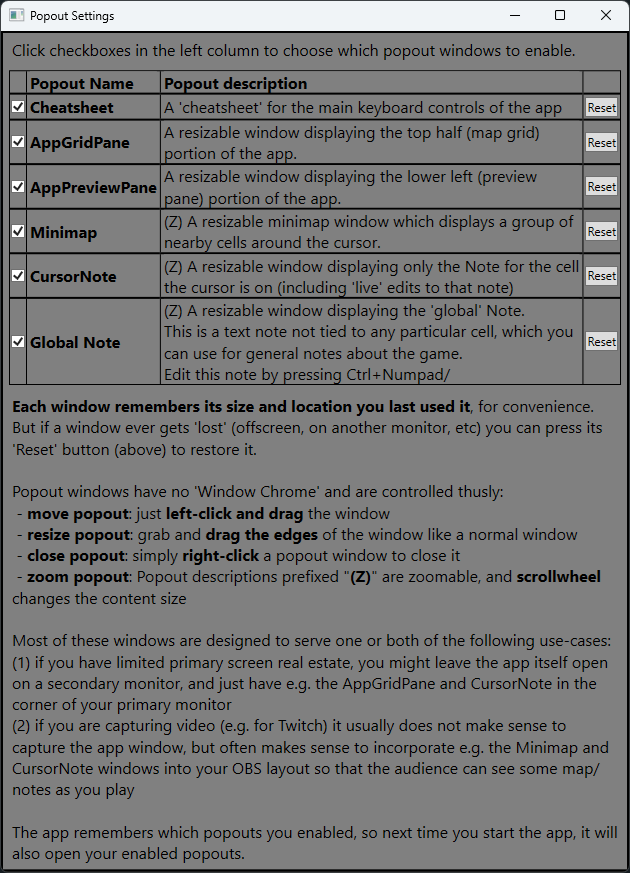

## Popouts

There are a variety of resizable popout windows which you can use, either to customize how to utilize your precious screen real estate,
or to use as OBS targets for specific parts you want to share with viewers.  Here's an example of the main popout windows that project
screenshots and notes out of the app:

In the picture above, the left column has the AppGridPane and the AppPreview Pane, and the right column has the Minimap, GlobalNote,
and CursorNote.  You control which popouts you want to use by clicking the 'Popouts' button at the top of the app, which brings up
this dialog:

Since popouts remember their settings, next time you use the app, all the same popout windows will open in the same locations/sizes/zooms.

