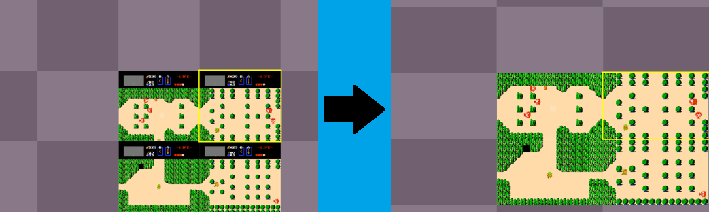
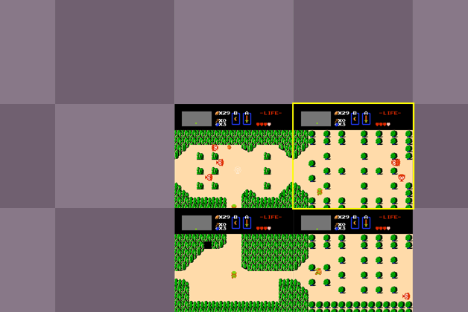
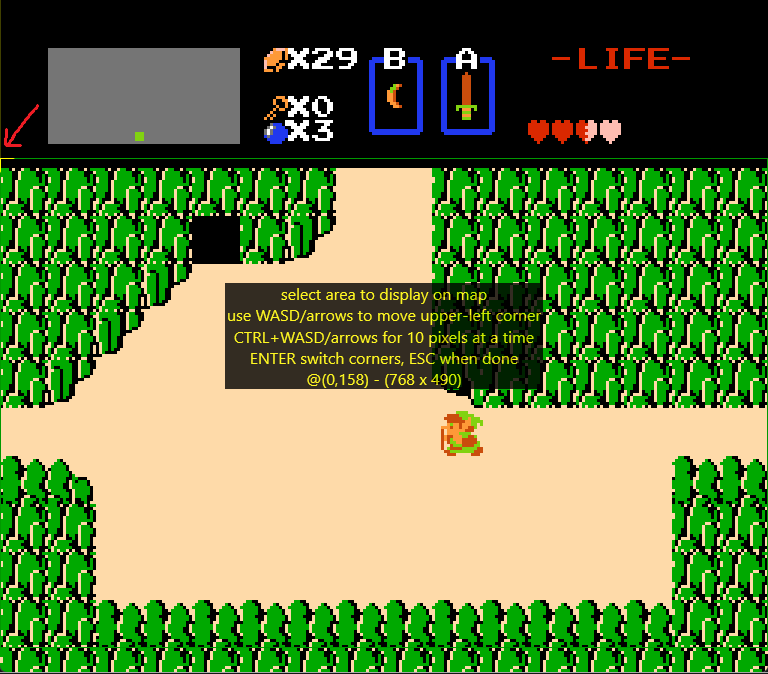
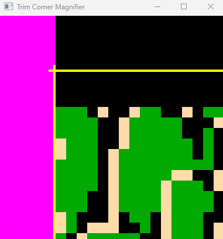
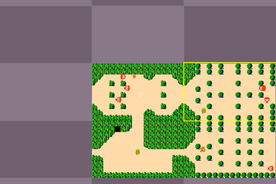

## Setting up a new game

The tool requires that all screenshots of the game window be the same size.  So **before using the tool, be sure to configure the
game itself to be in your preferred window size**, and that when you start up the game again another day it will still be the same size.

Then **start up the game first**, before starting up the screenshot tool.

When you first start the screenshot tool (by running `ScreenshotMapTools.exe`), the console window lists all the previous games you have 
used in the tool (if any), but the first option in the list is always "**0: New Game**".  So to set up a new game, type `0 Enter`.

Then you'll be asked which window process has the game you want to set up, and shown a numbered list of all the windows open on your computer.
Type in the number that corresponds to the game you want to screenshot.

Then it will ask you for a directory name (folder name) to save the screenshots; type a valid name (such as the name of the game, e.g. 'Zelda';
alphanumeric characters only) and press `Enter`.  Screenshots and other game info will be saved to that sub-folder, under the folder 
containing `ScreenshotMapTools.exe`.

The app then starts up, and you're ready to take your first screenshot!

Press `NumPad 0` to take a test screenshot.  You can then press `NumPad -` to 'cut' that screenshot out of the grid, if it's not one you intend to keep.

Note that the game constantly saves all your updates to screenshots and Notes, so you can safely exit the app at any time.	The next time you run the 
app, your game will be listed in the console window (e.g. "1: Zelda") at startup, and you can select it to continue where you left off.	

### Setting up a 'MAP Trim'

For many games, the 'screenshot map' you want to build will not be comprised of screenshots of the *entire* game window.  
This section explains how to to go from the map grid on the left to the map grid on the right:

The entire game window often displays more that what you want in your map grid:

* Some games have black bars at the edges of the window.  

* Some games have HUDs that always take up a fixed portion of the screen, with the gameplay happening in the remaining portion.

When we just start taking screenshots of a Zelda window, for instance, the map looks like this:

The 'MAP Trim' is the tool's way of letting you specify which region of the game window you actually want to display in the map grid.
(Note that the tool always saves full screenshots of the entire window; the 'MAP Trim' just lets you customize the display, without losing any screenshot information.)

Click the 'Trim' button at the top of the app, and then choose the 'Modify the MAP Trim' option.

A transparent overlay window now appears over the game, where you can change the rectangular area selection you want.  Here's how it appears after I have pressed
the down arrow a bunch, to move the upper-left corner of the rectangle (shown in yellow) down some:

It can be hard to see exactly where the overlay rectangle is over the game, so while you are adjusting the corners, the main app shows a trim magnifier:

You want to adjust things so that the Yellow upper-left corner frames the visible game pixels you wish to capture.

As per the instructions on the game overlay, press ENTER to switch corners, and then you can adjust the lower-right corner of the trim (which appears Cyan).
(In the particular case of Zelda, the game shows 10.5 tiles of height on the screen, and I choose to cut off the bottom half-tile, in addition to trimming off the top HUD.)

Once you are done, press ESC as per the on-screen instructions to save this new MAP Trim.  A message box appears saying that the app will restart, as it needs to
clear and recreate its image cache to account for the new MAP Trim.  Upon restarting:

Now the map grid stitches together seamlessly.

If you ever need to make adjustments, you can repeat the whole process via the 'Trim' button at the top of the app, but typically this is a one-and-done setup that 
you only need to do once when first setting up the game.

